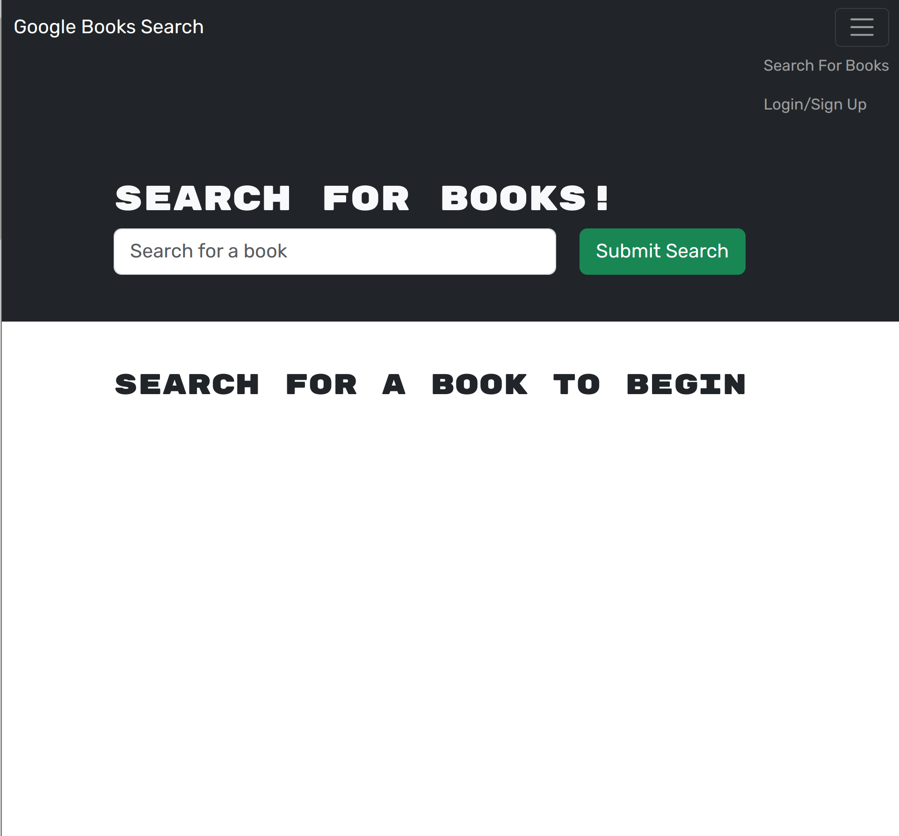

# Book Search Engine

## Table of Contents
- [Description](#description)
- [License](#license)
- [Installation](#installation)
- [Usage](#usage)
- [Credits](#credits)
	- [Resources](#resources)
- [Tests](#tests)
- [Issues/Questions](#issuesquestions)
- [Contributing](#contributing)

## Description
A google books api search engine that uses GraphQL under the hood.

Check out the website [here](https://ryansheehy0-book-search-engine-fa3caa38261a.herokuapp.com/)

## License

## Installation
First, clone the repo at `https://github.com/ryansheehy0/Book_Search_Engine`  Second, run `npm install` which will install all the npm packages.  Third, run `sudo service mongod start` to start your mondgoDB server locally.  And finally, run `npm run develop` to launch the app.

## Usage
Just type books in the search engine and they will pop up with an image, description, and much more information about the book. Sign in or login in in the top right to keep track of your favorite books.

## Credits

### Resources
- [express](https://www.npmjs.com/package/express)
- [graphql](https://www.npmjs.com/package/graphql)
- [@apollo/server](https://www.npmjs.com/package/@apollo/server)
- [@apollo/client](https://www.npmjs.com/package/@apollo/client)
- [jsonwebtoken](https://www.npmjs.com/package/jsonwebtoken)

## Tests
Just [install](#installation) and run the app.

## Issues/Questions
If you have any problems please specify what the problem is and the exact steps that lead you to your problem.

If you have any questions or issues feel free to reach out to me at

Github: [ryansheehy0](https://github.com/ryansheehy0)

or

Email: ryansheehy0@gmail.com

## Contributing
To contribute just make a pull request.